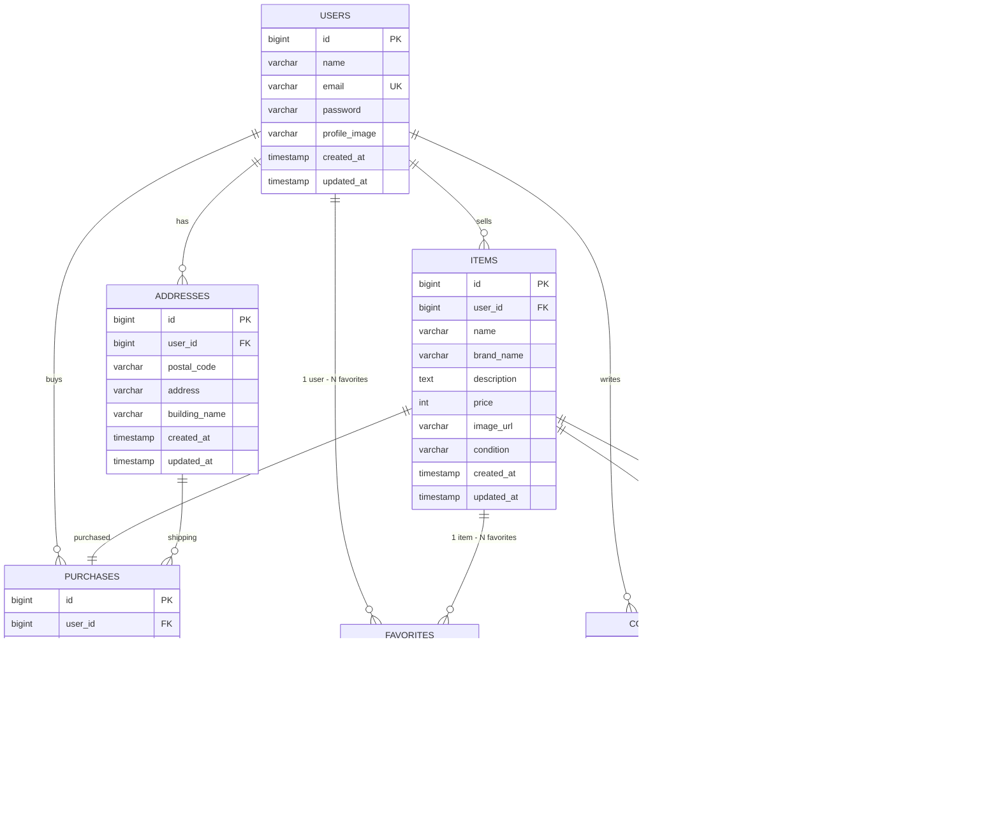

```mermaid
erDiagram
  USERS ||--o{ ITEMS : sells
  USERS ||--o{ PURCHASES : buys
  USERS ||--o{ ADDRESSES : has
  USERS ||--o{ FAVORITES : "1 user - N favorites"
  USERS ||--o{ COMMENTS : writes

  ITEMS ||--|| PURCHASES : purchased
  ITEMS ||--o{ FAVORITES : "1 item - N favorites"
  ITEMS ||--o{ COMMENTS : has
  ITEMS ||--o{ CATEGORY_ITEM : "1 item - N category_item"

  CATEGORIES ||--o{ CATEGORY_ITEM : "1 category - N category_item"
  ADDRESSES ||--o{ PURCHASES : shipping

  USERS {
    bigint id PK
    varchar name
    varchar email UK
    varchar password
    varchar profile_image
    timestamp created_at
    timestamp updated_at
  }

  ITEMS {
    bigint id PK
    bigint user_id FK
    varchar name
    varchar brand_name
    text description
    int price
    varchar image_url
    varchar condition
    timestamp created_at
    timestamp updated_at
  }

    PURCHASES {
    bigint id PK
    bigint user_id FK
    bigint item_id FK
    bigint shipping_address_id FK
    int price_at_purchase
    varchar status
    datetime purchased_at
    timestamp created_at
    timestamp updated_at
    UNIQUE item_id
  }


  ADDRESSES {
    bigint id PK
    bigint user_id FK
    varchar postal_code
    varchar address
    varchar building_name
    timestamp created_at
    timestamp updated_at
  }

  FAVORITES {
    bigint id PK
    bigint user_id FK
    bigint item_id FK
    timestamp created_at
    timestamp updated_at
  }

  COMMENTS {
    bigint id PK
    bigint user_id FK
    bigint item_id FK
    text comment
    timestamp created_at
    timestamp updated_at
  }

  CATEGORIES {
    bigint id PK
    varchar content
    timestamp created_at
    timestamp updated_at
  }

  CATEGORY_ITEM {
    bigint id PK
    bigint item_id FK
    bigint category_id FK
  }
```
